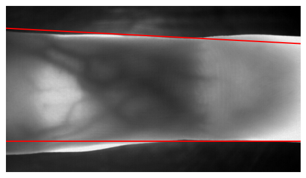

# Exercise Sheet 9


## Exercise 9.1 (4 points)

In this exercise, you will implement a **LoG (Laplacian of Gaussian) based edge detector** and compare it to a Canny edge detector.

**Task 1:** 

Implement the LoG based edge detector function shown below. 

````python
def log_edge_detector(img, sigma):

	# 1st step: Apply a LoG filter (i.e., scipy.ndimage.gaussian_laplace)
    # 2nd step: Detect all zero-crossings (edges)
    
    return binary_edge_mask
````

Plot the result(s) for an image of your choice using different sigma values.

**Task 2:**  

Visually compare the previous results to the results obtained with a Canny edge detector. For instance, you can use `skimage.feature.canny` for this purpose.

Briefly explain why/how the Canny edge detector achieves its superior results.


## Exercise 9.2 (4 points)

You are given an image of a fingervein (`fingervein_orig.png`). The goal is to first detect the vein's contours and then fit two straight lines using a **Hough transform**. 

The obtained result should roughly look like this:




**Hint:**

- `skimage.transform.hough_line`
- `skimage.transform.hough_line_peaks`


### Important remark:

- Submission deadline: 13th Jan, 23
